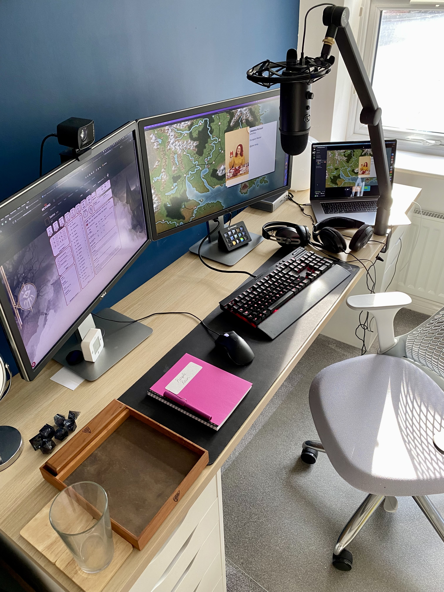
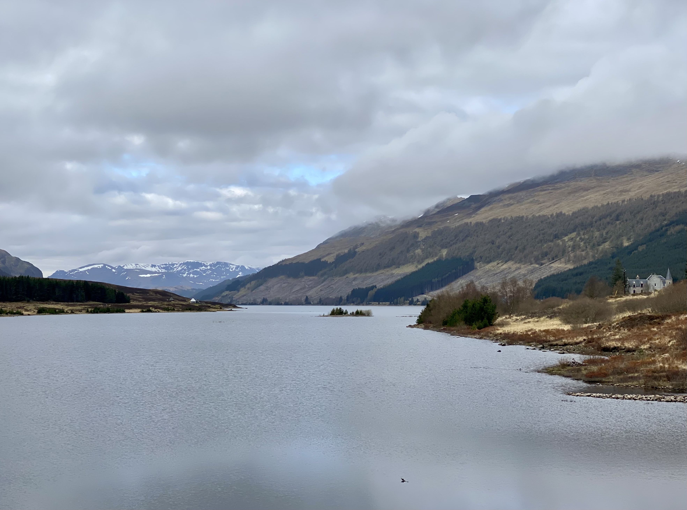
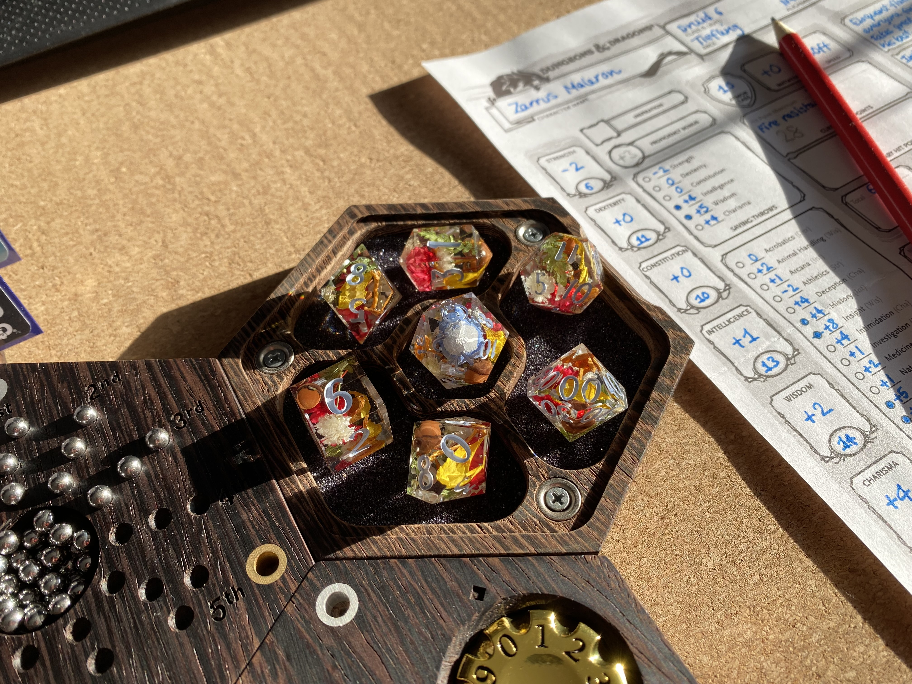
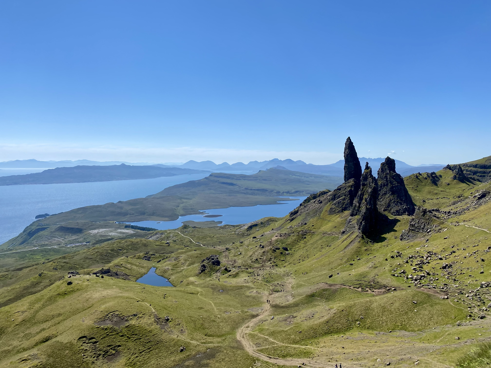
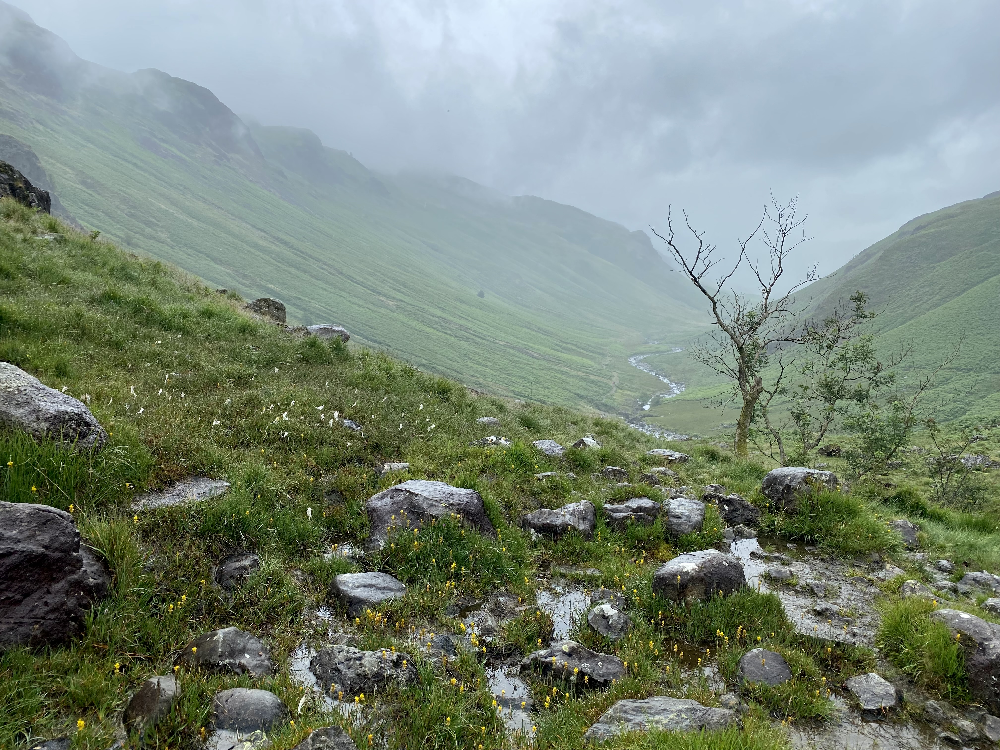

# Hobbies in 2022: Passing the Torch of Obsession

## Retrospective

It's almost the end of the year, so what better time to reflect on how I chose to spend the most notable portions of my spare time in 2022. I might even learn something about who I am along the way.

In particular I'll be focusing on Dungeons & Dragons and domestic travel. I could also talk about playing video games or watching unhealthy amounts of YouTube, but I'd prefer to focus on the activities that I'm comfortable defining me.

## Dungeons & Dragons & COVID-19

I started playing D&D around the start of COVID-19 and the subsequent first lockdown here in the UK. After immersing myself in a campaign ran by the lead programmer at my job, I endeavoured to be a Dungeon Master myself. This meant gathering a party of players, scheduling sessions, and in my case, writing all of my own source material. Every character, story twist, setting, and battle were my own.

Entering 2021 I had a healthy ongoing campaign with happy players, each playing online from different European countries. In January I doubled down by starting a second online campaign, then in September I added an in-person campaign with close friends from my local area.

Needless to say, I was obsessed. D&D had not only become my main hobby, but my *only hobby*. Storytelling for others became an immense source of joy and pride. Each weeknight and large portions of my weekend was spent preparing for upcoming game sessions. I liked it this way because it kept me busy through the ebb and flow of COVID-19 lockdowns and isolation following an increasingly busy social life in 2019. I had started my second campaign specifically to nix delirium during the UK's second lockdown.

As 2022 began I was at the height of my craft. The stories I had created were maturing, yielding plot twists, revelations, and interconnectedness in a universe where three campaigns worth of characters coexisted, albeit rarely interacting directly. My Dungeon Master setup was a clockwork blend of software dependencies, desk real estate, Discord channels, a self-coded Markdown wiki, and all manner of visualisations, all self-concocted through persistent late nights. In January 2022 I ran 35 hours of play across ten sessions, while my collective setting and campaign notes neared half a million words.

While that all sounds frightful, I was in my element. I would daydream of directions we could take the stories, and concocted fresh ways to delight my players. I felt comfortable with the committment, confident I was just printing enjoyment. After all, you can't have too much of a good thing, right?

## A Job That Felt Like a Hobby

As the new year arrived I was already on my way out of my previous senior web engineer job, on my way to new role in mid-January. I was in need of a new challenge, one that would test the limits of my abilities.

Naturally any new job is demanding of a lot of your energy - you have new people to befriend, systems to learn, and institutional politics to sniff out. My reputation was virtually reset to zero, with a probation review keeping my performance in sharp focus.

Quickly I found joy at work again. Trust was put in me quickly, and before long I was steering a new project, acting as a conduit of information and decision making amongst more people than my previous company had employed. I believed in the project - as a customer I was excited by it, so I was proud to deliver it.

When you are enjoying yourself, you don't notice or necessarily mind it when time slips away. An inflexible deadline left me on a shortlist of developers who felt it necessary to put in longer hours to land the plane. I gave it freely; I wanted to succeed. I wanted to be proud.

It is simple to think of a day as three parts: work, leisure, and sleep. Every day is a zero-sum game: making time for one pursuit pushes all others out. More work equals less hobby time.

## A Hobby That Felt Like a Job

Dungeons & Dragons inherently requires other people. If I were to write a campaign entirely by and for myself, I'm really just writing a book. Requiring other people means schedules, dates, obgliations. Let's meet every X weeks at Y time.

It's hard to "phone it in" with D&D, especially when you're writing your own content (*homebrew* in roleplay vernacular). Your players have opinions on whether a session is enjoyable or exciting or moved the story forward meaningfully. Typically I put as many hours into preparing for sessions as I did the sessions themselves. An average of six hours of session time per week becomes 12 hours, and can balloon further when one campaign travels to a new area.

Eventually it dawned on me that I was perpetually on the clock, working towards the next session - the next deadline. If I don't sit and squeeze creative juice out of myself for several hours this evening, I will have more to do tomorrow, and under more pressure. Sometimes I couldn't do it, which lead to anxiousness, so I felt I had no choice but to cancel the session. This unhealthy cycle is inherently unsustainable.

As a people-pleaser it pains me greatly when I don't feel I'm meeting my obligations, or my efforts aren't received with the love and attention I have baked into them. I would often ask my players for specific feedback on sessions, and brush aside all praise in the pursuit of fixing shortcomings. I could always do more/better.

It was hard not to see similarities with work. Both were deadline driven, both required excellence on a short timescale. Historically I've gone to great lengths to keep work separate from the rest of my life, but here I was, approximating the former in my spare time. Increasingly I subconsciously rebelled by putting off prep for another day, consigning myself to an evening with my feet up staring blankly at a screen. A welcome respite for the hurried mind. Was I still enjoying myself?

## That Fateful Day in Scotland

By mid-April the work project had been released and I'd taken a week of holiday as a reward. On the first day I planned to meet a colleague in her city of Edinburgh, two-and-a-half hours away by car from my northeastern English home.

Rather than spending a five hour round trip for a meet & greet with dinner I opted to make something of the day. Initially I couldn't figure out what I might like to do through the day in Edinburgh or the surrounding area, so I took the search back to a fundamental question: *what excites me about Scotland?*

The answer, distilled through several years of visiting my girlfriend in the Lake District, was hills and lakes. Scotland had both in spades, so it was just a case of picking a destination. I had vague memories of visiting Loch Ness as a child, and now the adult means to go there on a whim. After a bit of research, [Urquhart Castle](https://www.historicenvironment.scot/visit-a-place/places/urquhart-castle/) was chosen as the destination.

I set off at 04:00, keen to have enough time to reach my destination, return to Edinburgh, and stop as I may along the way. A typical creature of habit, traversing unknown roads and pushing on into untapped scenery was refreshing, reinvigorating. While the A9 to Inverness is notoriously boring to drive, I revelled in the snow still clinging to the Grampian Mountains. A mundane glance at my satnav revealed a patch of blue near the road, so I deviated, rewarded with my first loch of the year - [Loch Ericht](https://en.wikipedia.org/wiki/Loch_Ericht).

All of this was possible with a day of spare time, an early alarm, and the drive to find somewhere exciting. I was hooked. Soon I was at Loch Ness, then visiting Urquhart Castle before midday, despite being over 300 miles from home. If I had travelled south instead of north, I'd be in London.

The rushed journey to Edinburgh acted as a teaser, a prompt to return post-haste: Loch Lochy, views of [Ben Nevis](https://en.wikipedia.org/wiki/Ben_Nevis) (tallest mountain in the UK), and Loch Laggan. If the drive *through* was this stunning, to the point where I was late for stopping so much, what might I find off the main road?

Domestic travel was now on the menu, and I was hungry.

## Crushed by the Weight of Obsession

Negativity flippantly breeds negavitiy, whereas positivity must be nurtured with care.

Setting increasingly high standards and obligations for D&D only placed more pressure on me to deliver. As my love of the hobby began to waver as a consequence of other facets of life, the death spiral became clear - I had created a system that required the maximum amount of effort and creativity that I could muster, and I am not a factory. It was no longer simply enough to swim against the tide of upcoming sessions.

I reflected, both alone and with close friends, on the possibility of scaling back. I wanted to cut out as much prep as possible as I was finding it a tedious chore, bringing the balance back to exciting and gratifying session play. Despite the self-realisation, I couldn't deliver on the execution - in my mind any sort of retreat was failure. Thus, negativity was born.

It has been levelled at me that I am an "all or nothing" person, and I concur. My hobbies are easy fixations with limitless potential, and much like a gas expanding in a vacuum, my appetite expands into all of the possibility space. It wasn't enough for me to tell a compelling story, I also needed to:

- Tell three stories, intertwined and concurrent, rather than putting that same effort into one exceptional story.
- Write a wiki of session notes, character details and settings, all never to be seen by anyone else, rather than settling for a Google Doc.
- Program software to organise said wiki when it became too unwieldy, rather than trimming the fat.
- Bootstrap a virtual tabletop game for in-game battle visualisations, rather than using an off-the-shelf VTT.
- Create custom character models for characters important and minor, rather than letting players' imagination paint a picture.
- Curate a dozen ambient music playlists on Spotify, rather than finding pre-made playlists.
- Program a TV graphic-esque overlay for [OBS](https://obsproject.com/), wildly increasing how many plates I was spinning as Dungeon Master during a session, rather than accepting a less visually appealing experience.
- Plan one-shot campaigns and tournaments with complete strangers, complete with bespoke scenarios, rather than seeking out similar experiences as a player.
- Collect dice, particularly expensive handmade resin dice, rather than settling for a few moderate quality functional sets.

Each extra facet left less time for the others and made it easier to dance around the prep I loathed to complete. I was buckling under the weight of my accumulated undertakings and couldn't bring myself to shed weight.

## Having the Courage to Stop

Eventually it became too much to bear. A trifecta of circumstances started tumbling the D&D house of cards:

1. I had felt unsatisfied with my second campaign since late 2021 for various reasons, and was frequently too anxious to prep. I had to pull the plug for my own health, regardless of the consequences.
2. The outbreak of the Russo-Ukranian War and anti-transgender state government policy in Texas in quick succession drained my mental health and capacity for hobbies.
3. Net positives from dropping one D&D campaign, despite initial sharp feelings of guilt and friendship strains, bolstered my resolve to make further cuts as needed.

Shuttering a D&D campaign is such a mixed bag, dependent entirely on your players; some will understand and support your reasons despite their sadness, while others will begrudge the loss of the game and their time investment. The only way to know is to rip the plaster from the skin. It is hard to willingly confront yourself with the delicate undulations of adult friendship - how some people will drift from your life forever and that is both okay and normal.

By quitting I was also closing the book on a body of work that I had been developing for two years. Stories unresolved, characters never met, places never visited, evils never vanquished. The hobby can always be revisited later, but the magic circumstances of now might be more ethereal. I might never play D&D again. I might never speak to my players again. But that was also true before D&D, so dust to dust.

In my adolenscence I quit my university photography degree, tanking the hobby I had nutured for years before pursuing it academically. This year proved much the same for D&D - as I wound down each of my three campaigns one after another, the ideas and aspirations vanished with them, save for a single one-shot ran for close friends. Only as the year draws to a close and I look back do I wonder what would have happened if I had persisted, or what I might do next in the hobby space.

It is easy for me to frame this all as giving up. After all, it is unresolved through no fault but my own. However I choose to see strength in the uncomfortable act of stopping, rather than getting carried with the current of discomfort.

## Building Adventure Muscles

As D&D waned, the void was filled with more domestic adventures. A smattering of day trips got the ball rolling, getting me and friends to new sights in the Scottish highlands and English Northumberland. The country roads felt limitless.

Eventually I started staying overnight - initially just overnight trips. The first was on a trip to Loch Alsh and the Isle of Skye with a friend - the latter only possible with the night's stay. I got to see the Old Man of Storr with my own eyes, a bucket list item, the first place in the highlands that I'd ever known by name.

It feels silly to sing the virtues of *staying overnight when on a trip*, but I hadn't stayed anywhere since 2019, and before that I preferred the comfort of my own home and the technological entertainment contained within. Between my car and a hotel room, nowhere on the island of Great Britain was out of my reach. In June I spent a week in south England, then my girlfriend and I did the same in the southwest in September. Long weekends away, like the one on the Isle of Mull in October are becoming the norm.

I still haven't lost the wonderment of what lies over the next hill, around the next corner. It drives my trip planning. In an age where Instagram and now TikTok puts so much value on the visual aesthetics of a place, and Google Street View makes breaking the illusion so easy, I am consistently thrilled by seeing remarkable places first-hand.

My worry as my travel ramped up was that the hunt for new exciting places would be one of diminishing returns, with increased travel costs and less bang-for-your-buck. But I've also enjoyed revisiting places, principally with different people, because of the satisfaction I get from delivering an incredible experience to someone - much the same feeling D&D kept rewarding me. Four trips to one place wasn't out of the question this year. I look forward to returning to familiar places in 2023 too.

## Obsession Redux

So with domestic travel now my dominant hobby, how will I inevitably ruin it for myself?

While I've learned that too much of a good thing is indeed possible, travel is much harder to have in excess. Limiting my travel to weekend and work vacation days should provide a firm limit on creeping ambitions and it keeps my weekdays free. Travel is an order of magnitude less preparation than D&D, so I have the vast majority of my evenings free for other pursuits or relaxation, and the time I do have to commit to planning isn't as pressing - I can do it when the mood strikes.

The start of any sort of travel obsession this year was looking at my Apple Photos albums for 2022 grow, then setting my sights on beating 2019's album count of 34; I blew it out of the water with 75. Setting an arbitrary goal like this helped spur me on at times when I would have quite happily lazed at home. Beating the high score in 2023 wouldn't be a healthy target.

As my experience of travel planning has increased, so too have the steps in my method. I now maintain a custom Google Map with all of my travel ideas pinned to it, and my web browser is littered with tab groups devoted to future trip ideas. Recently I created a Trello board to help schedule a litany of trips next year around busy school holidays and friends' committments.

Admittedly the concept of blogging about travel is one more facet to add, one more obligation to complicate each trip. Fortunately I don't think failing to write a blog will spoil my enjoyment of travelling or affect how I approach future trips, though only 2023 will know for sure.

## The Power of the Slient Depths

There is a healing power out there for me between the hills. Its name is depth.

Large spaces are a frequent source of awe for me, reminding me that my viewpoint is only one reference point for scale. It is fascinating to look up at the roof of a cathedral and admire the effort that went into its creation, all to capture this feeling. Natural vistas compound this feeling with the geological timescale.

Standing on a hillside overlooking a stream that continues the work once undertaken by a glacier to carve the valley below, it is hard not to feel insignificant, like a blip of consciousness in a cold uncaring universe. Nihilism triggered by depth like this is terrifying to some, but not me - I find comfort here.

When I've had difficulties this year that feel insurmountably world-ending, existing amongst mountains has grounded me in how unimportant these worries are. Similarly, the stunning silence of a near-empty landscape is the antithesis of an always connected, feed scrolling, push notification, attention grabbing world that keeps me at a base level of slight exhaustion.

Running off to the highlands or the Lake District certainly won't solve any of my problems - more meaningful changes must be made, but snatching a breath during the worst of it is valuable. Having respite to look forward to is at least light at the end of the tunnel.

## Riding the Wave into 2023

As 2023 begins, so too does a new year of hobbies. From where I'm standing it seems clear that domestic travel will dominate, though with a trip to Iceland on the cards, international travel may be ascendant.

2022 has shown me that the future is always uncertain, and even when I thought I had my interests figured out, it is possible to be completely wrong yet be the richer for it.
