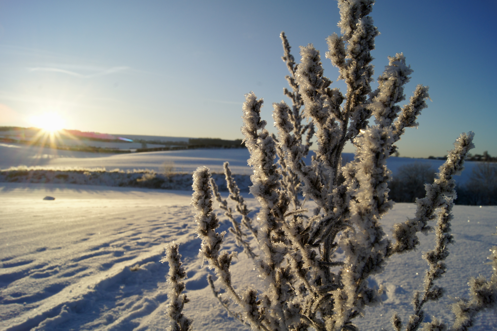

# Committing to Adventures in 2023

- Tags: Weekly Adventures 2023, Monthly Adventures 2023

This year I want to travel more and see new places. As someone whose main hobby is traveling, this seems like an obvious choice, but I've put in place some rules that should transform this New Year's resolution from a sentiment into a challenge.

## Weekly Adventures

Habit is constructed from equal parts routine and diligence. By committing to spending at least some time outdoors each weekend, I'll provide myself with a year's worth of excuses to visit interesting places.

**Every weekend I will:**
- Name an outdoor location for adventure.
- Spend at least 1 hour outdoors at that location.
- Take at least 1 photo while there.
- Write a blog post about the experience.
- Not name that location for adventure until the next half-year.

Needing to "name" the location of an adventure and keep it unique per half-year forces me to venture to different places each week. While I may be tempted to pick "low hanging fruit" like a local park or forest trail, the more I do so, the further I will have to travel subsequently. From 1st July I can name places a second time if I wish, though in the spirit of the challenge this will be reserved for seasonal differences and to keep my travel mileage down over the entire year.

There is nothing stopping me from returning to a previously named location, I just can't count it as my weekly adventure. I'm sure there'll be times this year when I enjoy a place so much that I want to return soon, often, and/or with someone else.

Writing a blog post for each adventure invites me to introspect, critique, and share.

## Monthly Adventures

Larger adventures were my favourite moments of 2022, memories that will live on for years to come. In 2023 longer trips will provide me access to further flung locales and enduring calm.

**Every month I will:**
- Name a place or region for a larger adventure.
- Spend at least 2 consecutive nights in that place or region.
- Write a blog post about the experience.

While I'm not imposing any uniqueness rules for monthly adventures, I will be using this as an opportunity to visit twelve different places. I may well end up on the [Isle of Skye](https://en.wikipedia.org/wiki/Isle_of_Skye) more than once this year, but a second trip will be between other monthly adventures.

I have an ever-growing list of places I'd like to explore, and this year I'm going international, so the door is truly wide-open. Still, I yearn for more of Scotland, and I've spent little time in Wales in my life.

## Holding Myself Accountable

This blog will act as a public archive of my adventures. The tags [coming soon to] the top of this post will provide lists of weekly and monthly adventures for easy perusal.

Hopefully by the end of 2023 I'll have visited plenty of incredible places!
