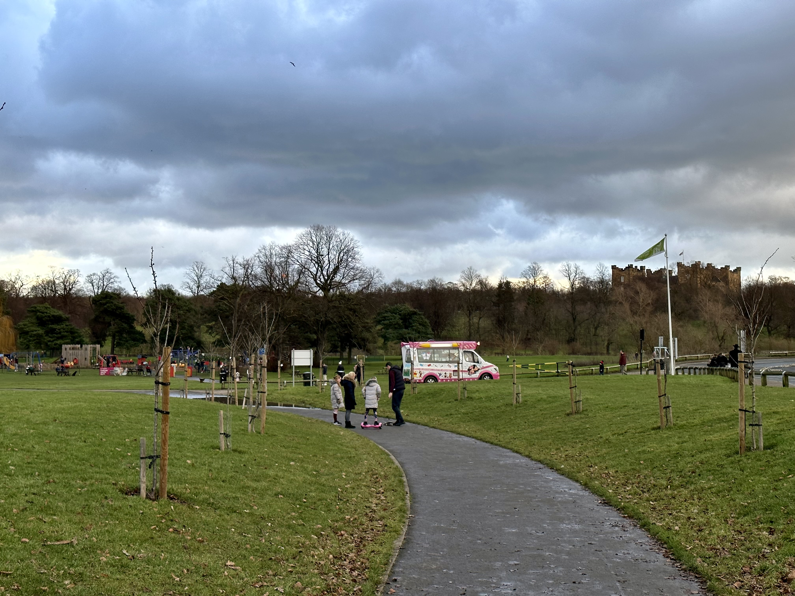
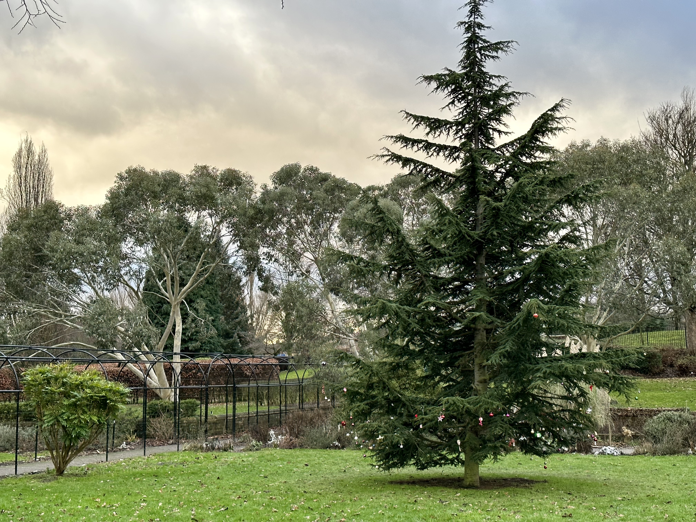

# Adventure Week 0: Riverside Park, Chester-le-Street

- Tags: Adventures 2023

To start an entire year of weekend adventures somewhere outdoors, I began close to home - at my local park.

## Week Zero?

With New Year's Day falling on a Sunday, and the start of the week typically thought of as Monday in the UK, it is hard to make the case for a single day constituting the first week of the year.

Turning to a programmer's favourite standard, [ISO-8601](https://en.wikipedia.org/wiki/ISO_8601), we can convert our familiarly formatted date of `2023-01-01` to the week format, producing `2022-W52`. By this measure at least, our first week of 2023 begins on the second day of the year.

Still, to keep everyone happy, and because I wanted to be outdoors on New Year's Day, here we are all the same.

## My Local Park

Riverside Park is a moderately sized public park in Chester-le-Street, a ten-minute drive from my house. It plays host to people of all ages, and a variety of events including [Riverside parkrun](https://www.parkrun.org.uk/riverside/) every Saturday morning. As far as town parks go, it's not particularly exceptional. There is ample parking, a children's playground, plenty of paths, and as pictured above, there's often an ice cream van.

Beyond its open grassy front, overshadowed by [Lumley Castle](https://www.lumleycastle.com/) across the river, the park stretches out into a series of fenced areas before devolving into a simple tarmac strip running along the riverside itself.

## New Year's Day

While it is easy to imagine what Christmas Day might entail, and even Boxing Day's allure as a rest-day is well known, New Year's Day is inherently uninteresting past midnight. Still, it feels necessary to commemorate the coming of the new year in some form.

For Sophie and me, we opted for McDonald's followed swiftly by a walk to feel better about it. Not really "start as you mean to go on" of us...

I was surprised to find an almost full car park and plenty of park visitors. Maybe we weren't the only people wanting to start their year with light exercise. Being amongst family groups and excited children helped bring a sense of community despite no words exchanged from each bubble.

The first matter of business was to decide on a direction. The park lends itself to a single circuit, as two separate paths that circumnavigate the main area meet near the river at the very back. Sophie opted for clockwise - ever the gold standard. Most others concurred.

## Infrequent Familiarity

As we started our walk, I found myself wondering why we don't visit more often. This is our closest park in the typical definition of the word - a place for people to relax, play, and exercise, all in a well-maintained green setting. After all, we can be here any time we want within ten minutes. My dad runs here or another similar park every Saturday like clockwork.

Firstly, I think it's easy to sit at home and stare at one of three different sized screens rather than depart into a world of weather, mud, temperature, and effort. Even as someone who recognises the value of [*Shirin-Yoku* 森林浴](https://en.wikipedia.org/wiki/Nature_therapy), even when not in the moment, motivation rules all. We are wired to take the easy route.

Secondly, the chase for new experiences, new horizons, and the joy of new favourites demotes the familiar, the local. I could go to my local park any time, hence my disinterest. Only when here do I remember how fortunate we are to have such a resource in our community, and visiting it is celebrating it.

## A Park in Winter

Riverside Park has a section of fenced off areas filled with interesting structures, bordered by sanctioned graffiti-covered walls, and logs carved into the shape of animals. To walk through it is akin to perusing a museum.

We happened upon a family approaching a lone pine tree, getting a closer look at dozens of Christmas baubles hanging from its branches. It is unclear for what reason they were put there - was this a concerted effort, or an ad-hoc crowdfunded decoration where visitors brought their own after seeing the initial spark of creativity? At any rate, a whimsical sight to remind us of the season.

So too, the River Wear itself. After heavy rainfall over the last few days, it had burst its banks and flooded the path running directly alongside it which was to be our return route from the park's opposite end. Fast flowing water rushed past as ducks and swans battled with the currents.

The meeting point of the waterfowl is typically a small sandy shore on the opposite side of the main park area. Here everything from seagulls to swans to coots gather, motivated by bread and seed donated by regular park-goers. Today the shore is underwater, but habits stick, and the dance continues. On a parallel path we navigate around several swans, popular with young children today.

Further round in the direction of Lumley Castle and with the car park in sight, we follow the river's edge to a lesser used corner of the park. Here the castle's golf course can be seen across the river. We follow it until our path becomes a public footpath, demarcated by its exit from the park under a road bridge.

Here there is an old stone brick outcrop where a clearer view of the water can be had. It was brown with silt and mud, much like the colour of the winter trees opposite.

Without snow, this time of year isn't considered photogenic. Certainly, the colours and abundance of life in spring and summer lends itself better to heightened appreciation of nature, but this part of the cycle is just as important. While not as visible, mammals, birds, and bugs play their role in the cycle of life.

