# Adventure Week 2: Ribblehead Viaduct and Whernside

- Tags: Adventures 2023, Hiking, Rail

My first hike of the year takes me to the Yorkshire Dales for an explore of Ribblehead Viaduct and Whernside overlooking it, wrapped in unexpected overnight snow.

## Ey Up, Yorkshire Dales!

With a four-hour hiking circular planned and limited winter daylight, the day started early. In the car at 06:15 for a 08:30 start, the journey down the A1(M) to Catterick was entirely in the dark. Only once past [ITC Catterick](https://en.wikipedia.org/wiki/Infantry_Training_Centre_%28British_Army%29) and into the [Yorkshire Dales](https://www.yorkshiredales.org.uk/) did the early morning light begin to show itself.

Streaks of white across the hilltops were a welcome surprise - snow, not forecast, graced the dales and added further intrigue to a day of exploration. As I drove the meandering valleys in search of my starting point before Ribblehead, the hills grew whiter and more prominent.

I can't honestly say I have a strong concept of the Yorkshire Dales - where they start and end, what wonders they contain, and despite knowing where they are on a map, they felt intangibly distant. The area might not have the recognition of the Lake District or the heights of the Scottish Highlands, but the place is no less deserving of my intrigue. Today I would make something of the dales for myself.

## Ribblehead Viaduct

Parking up in the gravel lay-by, I was car number three that morning, and nowhere close to last. This place was chosen due to its proximity to [Ribblehead Viaduct](https://en.wikipedia.org/wiki/Ribblehead_Viaduct), the first place I wanted to visit today. On the wide, well maintained gravel path leading to the stone arches, the orange glow of the sun trying to appear behind low clouds greeted me.

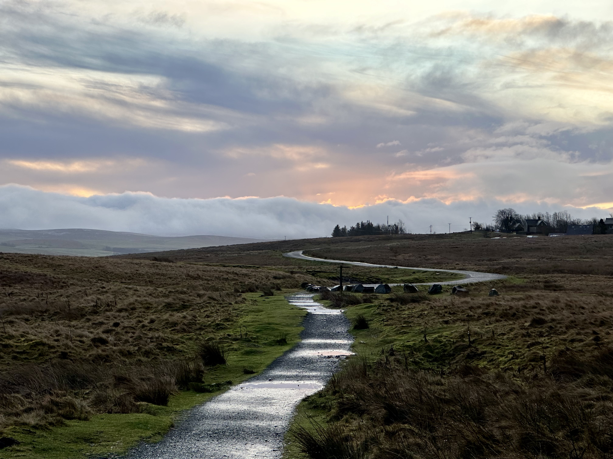

The path brought me past the impressive spans, constructed in the late nineteenth century to meet growing demands for rail services in north-west England. 2,300 men were charged with constructing it. Over 200 died in the process. A large metal plaque before the viaduct pays tribute to their efforts, though the structure's lasting presence and use does them better tribute.

It is hard not to be awestruck by a viaduct this long, seemingly in the middle of nowhere. Finding an angle from which to photograph the full bridge, contextually seated within the moors, proved challenging, even after treading *off-piste* to ascend a nearby hill. Compounding the issue, snow-kissed [Ingleborough](https://en.wikipedia.org/wiki/Ingleborough) hid in the clouds beyond.

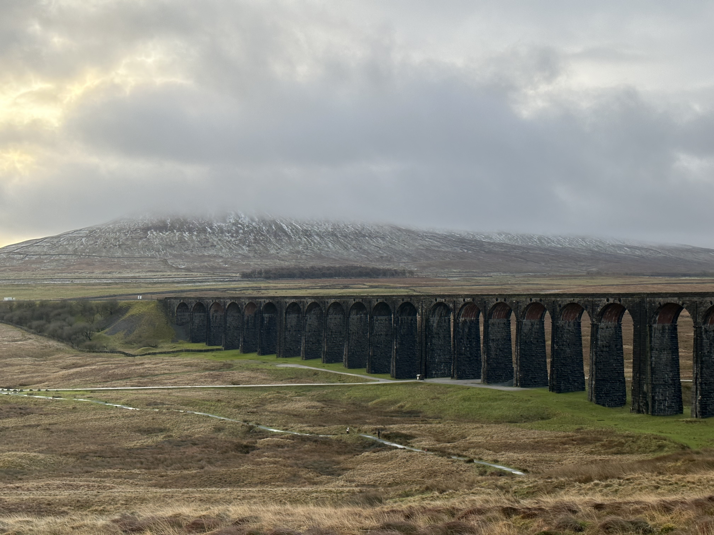

## Finding a Vantage for Steam

Beyond the adventure of new places and the upcoming hike, my day at the [Settle-Carlisle line](https://en.wikipedia.org/wiki/Settle%E2%80%93Carlisle_line) was one of preparation, of research. The next two Saturdays will see [The Railway Touring Company](https://www.railwaytouring.net/) run steam locomotive powered day trips along the line, and I intend to be here to capture them as they thunder by. It would therefore be helpful if I knew where I could find good views across the line that would allow views of both the train and its surroundings.

Recently I had resolved to find the location of the photo used on the web page for [next Saturday's service](https://www.railwaytouring.net/the-winter-cumbrian-mountain-express), one of a hill-flanked section of the line, a bridge, and a flat-topped hill far beyond. Thirty minutes cross-referencing Google Maps with a [handy interactive map](https://settlecarlisle.exploremoresettlecarlisle.co.uk/map/) pointed me to Blea Moor tunnel, facing south towards Ingleborough. All that remained was to hike there.

The path led me up along the rail line, revealing long since disused [semaphore signals](https://en.wikipedia.org/wiki/Railway_semaphore_signal), and eventually, a signal box. Surprisingly the box was still in use by National Rail - a worker sat in the elevated box conducting his work. A reminder that the line still sees [daily services](https://settle-carlisle.co.uk/tickets-times-travel/timetables/leeds-settle-carlisle-timetable/) operated by Northern.

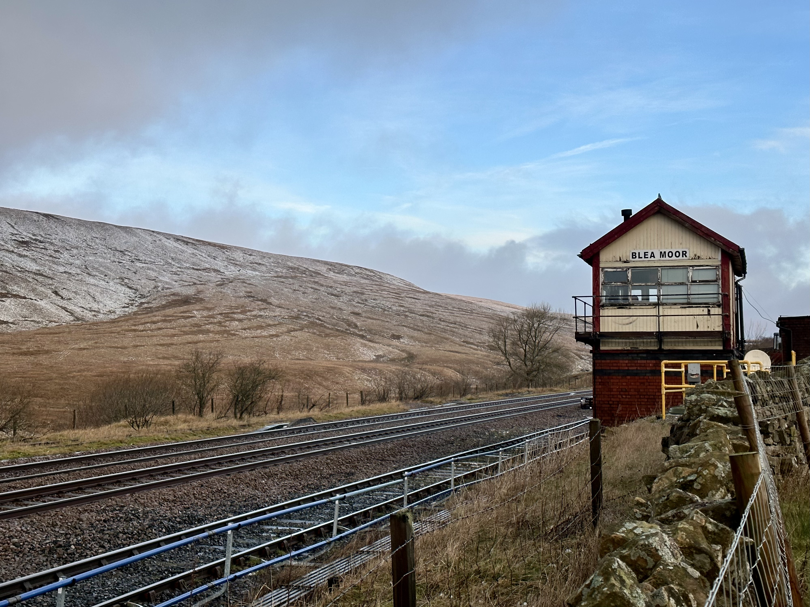

Beyond here, the path began losing its battle against nature. Two separate streams rushed down a nearby hill and across the stones, eroding much of the path and forcing a choice between teetering across slippery stones or hopping a narrower section of flow - the latter my preferred option. The second stream, completely engulfing the path, forced its maintainers to build a diversion and bridge to circumvent it. Benefits of the national park catering to the needs of [Yorkshire Three Peaks](https://www.yorkshiredales.org.uk/things-to-do/get-outdoors/yorkshire-three-peaks/) hikers, even inadvertent ones such as myself.

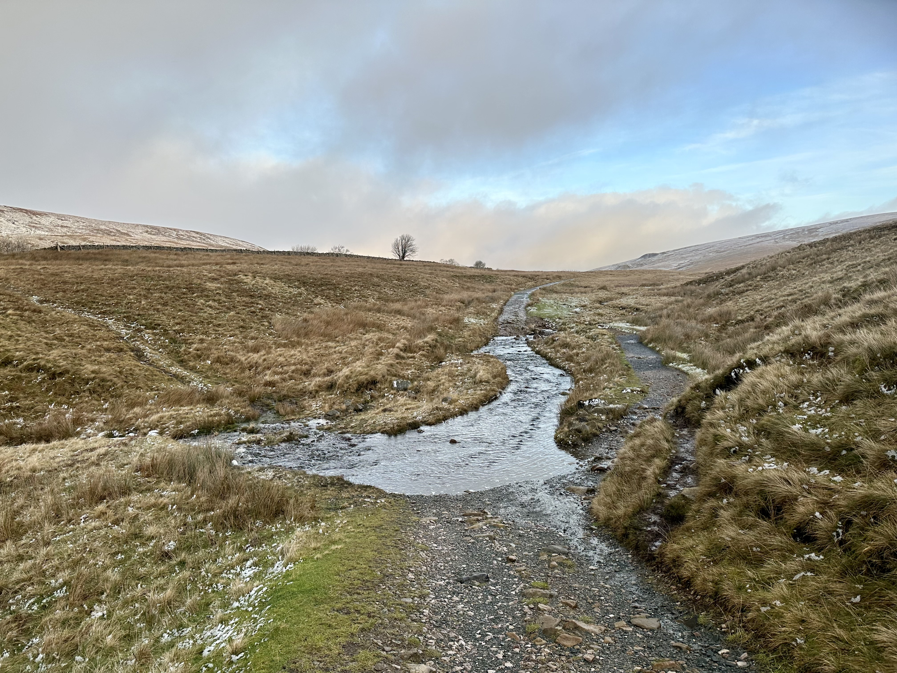

At this stream I hopped across to the left and ascended a faint trail towards a bridge over the line. This grass-covered span looked barely traversed and perplexingly led nowhere, only a descent to another stream beyond it. No matter, I was here for the view.

To the north, Blea Moor tunnel, seen under the next bridge on my route. To the south, the curve by Blea Moor signal box, and still unfulfilled promises of Ingleborough. From the opposite end of the bridge, I found a promising spot looking south; no obstructions, good elevation, compelling enough scenery, and a sense of this strip of metal blasted through the countryside. Its only detraction: garish metal boxes and signalling. 

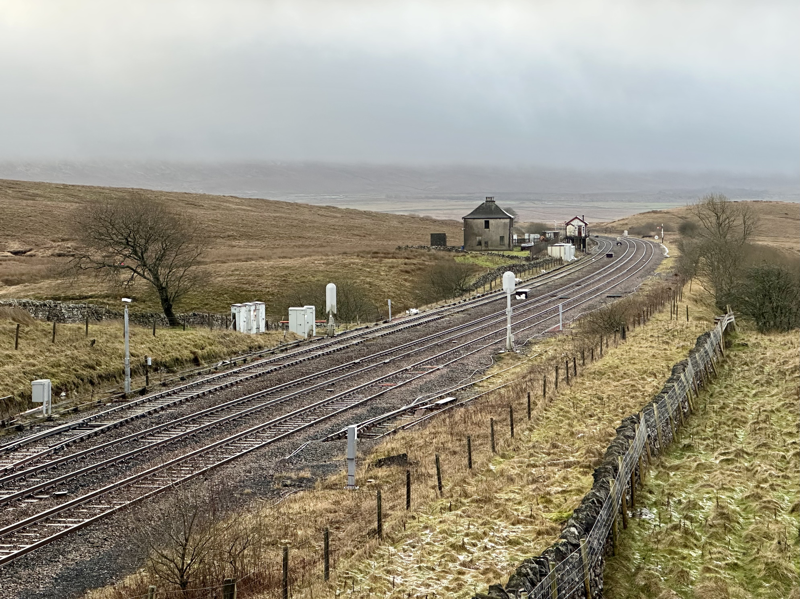

I pressed on, now confident of my destination. I could see the tunnel portal and the bridge before it. The path continued gently on the way. Other hikers passed me owing to my slow pace while stopping for photos. Polite brief conversation was had in the usual manner for hikers - brief pleasantries about the weather, the destination, and the conditions underfoot.

The next section proved to be the most troublesome of the entire hike. More hill water rushed across the trail, this time wide and boggy. The choices were: get wet and be direct, hunt for firm footing around the mud, or bypass on the hillside. I chose the mud and immediately regretted it as both feet slurped into it in quick succession, my socks above the ankle turning cold with moisture. Not hesitating I quickly got out, lamenting my choice as another hiker bypassed me above. It was hard not to feel out of practice, but every step is a learning experience, and the mud would soon fade. An investment in good hiking socks would keep the water at bay.

Before the bridge I watched the water flow between stone brick walls and across multiple choreographed weirs, navigating the S-bend gently and orderly. Moments later it struck me, looking backwards down the train line, that I had just witnessed an aqueduct. The stream here was intentionally diverted across a bridge to keep it from the rail line and allow it to proceed down the valley unhindered.

All that remained to my north was the final stretch of line before the tunnel. Here a box of stone brick wall encircles the cutting. Proceeding around to its rear behind the tunnel, I was soon dismayed to find no clear vantage point on the line and bridge below. Where had this photographer stood that winter's day? Without having downloaded their photo to my phone, I pondered idly. Was there an angle I was missing? Had they hopped the wall? Was their telephoto lens distorting my perception of this place?

I paced back and forth, looking for a gap in the wall, but there was none. Extra metal wire fencing had been affixed to the brickwork in recent times which deterred a climb, rightfully so considering the potential to tumble onto a live train line, even despite the smaller fence below. The dirt mound directly above the tunnel blocked the view I sought. There was only a small window where this hill subsided, though the angle was too oblique to match perfectly.

Perhaps I was fixating too much. Either way, I concluded that this view wouldn't work for me, and that is okay. Emulating others' photographs like-for-like is no realistic pursuit, and it is more interesting to find my own angle, my own view, my own commentary.

I had completed my mission: to find at least one spot from which I could take a photo of a steam train next Saturday. With two Saturdays to play with, and with agreeable weather, I would be able to experiment.

## Upwards to Whernside

Returning to the aqueduct, the path started to lead me along the Dales High Way. Here I saw the first typical hiking ascent of flagstone stairs and meandering routes, though it was hesitant to commit to a meaningful climb just yet. Underfoot I tread my first snow of the day.

In the distance, a cascade of Force Gill thundered. Even my thorough research into my destinations hadn't spotted a waterfall of this significance, so hearing and then seeing it in all its rainwater-charged beauty was a sight to behold. No closer view would be had as the path would ascend away from its gulley.

The Dales High Way rose the hillside, straight and consistent - just the sort of path to awaken slumbering thigh muscles, dormant after six months away from hiking. The relentless ascent here begged for periodic stops, which I initially obliged, before I began motivating myself by promising a rest at the next arbitrary milestone.

A stile and signpost pointed me across a diagonal shortcut. Here the path gained character, undulating its way up the hill, increasingly snow-covered. Looking backwards continued to unfold the landscape, views of the rail line replaced by rolling moors and low cloud cover. The sun hung low behind me, though it was tamed by an anti-glare camera filter.

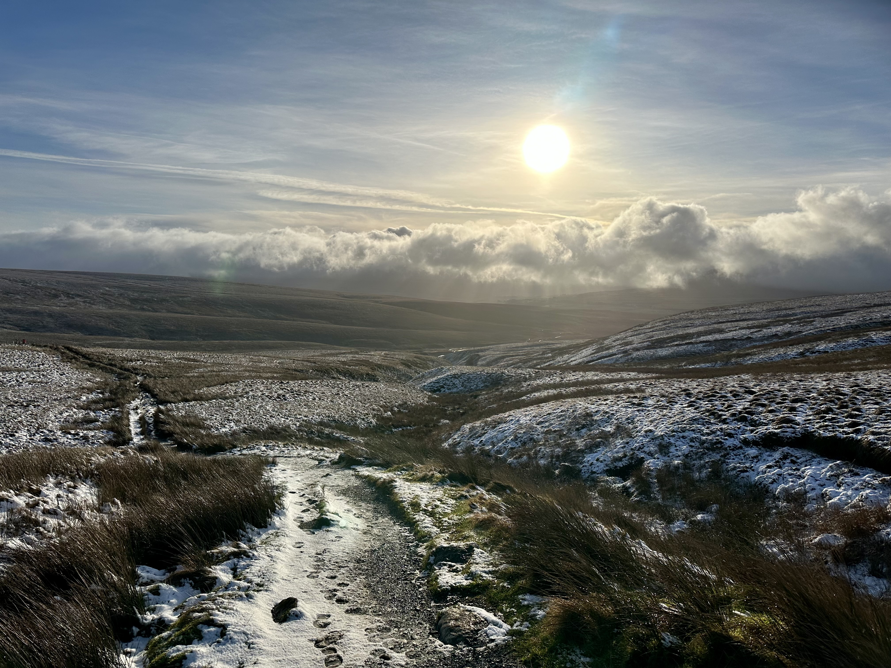

At this point I was curious where exactly I was headed. Like Ingleborough, Whernside started its day with its head in the clouds, making it hard to get a read on my destination. A smaller ridge (Greensett Craggs) below appeared a fair summit, though my exercise-addled brain could not then reconcile the taller snowier peak behind it. Cross-referencing my map allowed the penny to drop, right as the clouds began to depart and the ascent path was revealed.

Gravel turned to stone slabs once again, now covered with slushy footprints of those before me, making the climb treacherous and hesitant. At least slower meant less physically demanding. If only I'd brought my snow spikes...

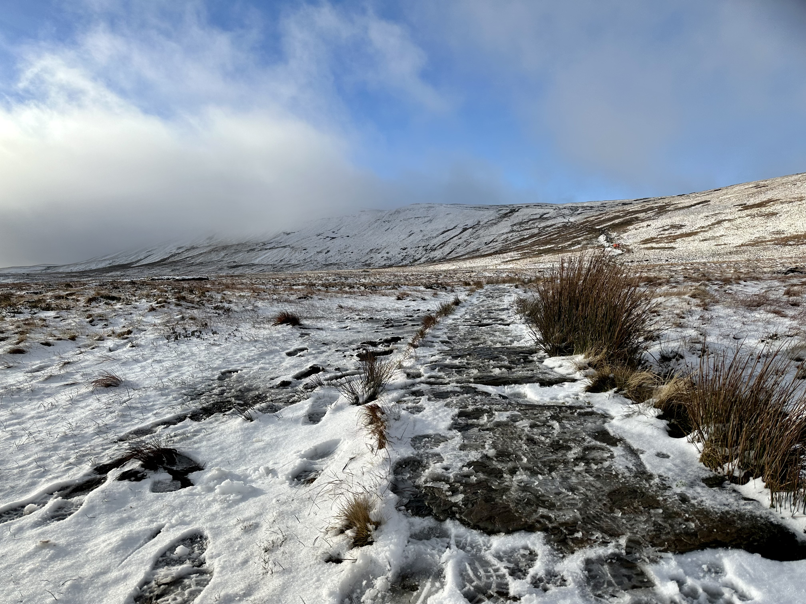

After the route levelled out onto Greensett Moss, it was back upwards again. Views to the distant east were now possible, though still teased by receding cloud cover. I was excited by the prospect of what might be visible by the time I summitted.

With the sun in the upper clouds, a view across the tarn below Whernside begged to be captured. To its side, shake holes in the limestone appeared as if craters on the surface of the moon.

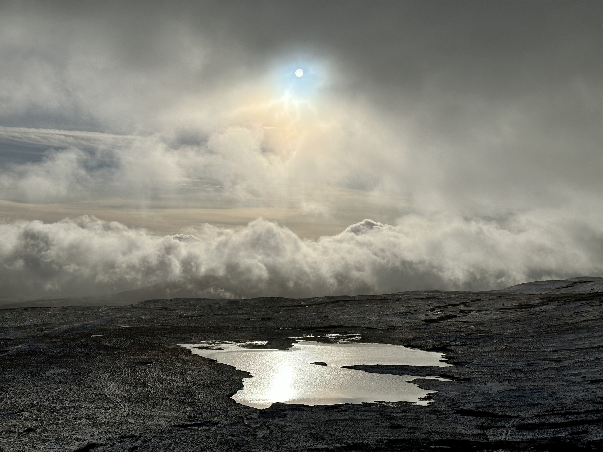

## A Snowy Summit

Eventually the route reached Whernside itself - a two-kilometre-long ridge overlooking Blea Moor and Ribblehead. On this side the slope is at its steepest, and the path was about to walk its crest like a tightrope.

Slushy stream-saturated trails gave way to crunchy snow as grip returned to my shoes. To my right, a fast-approaching stone wall and fence, demarcating one side of the ridge from the other, covered in glistening snow. To my left, precious few foot-widths of safety followed by an increasingly dangerous slope - serious injury awaiting anyone tumbling this way.

The cloud layer grew closer as the wind blew across the summit. Finally, I felt lofty heights.

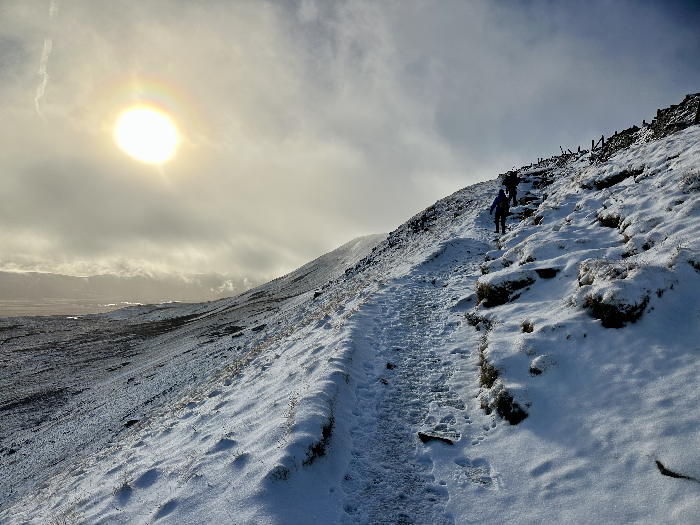

One benefit of such a ridge is that the ascent levels off towards the summit. The hard work was behind me. It was now time to drink in the scenery and beauty of this ice-blessed day. With the ridge reached, I was finally afforded views of its other side.

To the north-west: views across the green valley of Dentdale. Standing proudly behind, the [Howgill Fells](https://en.wikipedia.org/wiki/Howgill_Fells). Further back yet, the eastern Lake District's fells. Fresh winter air and the low sun behind made such views across 26 miles possible.

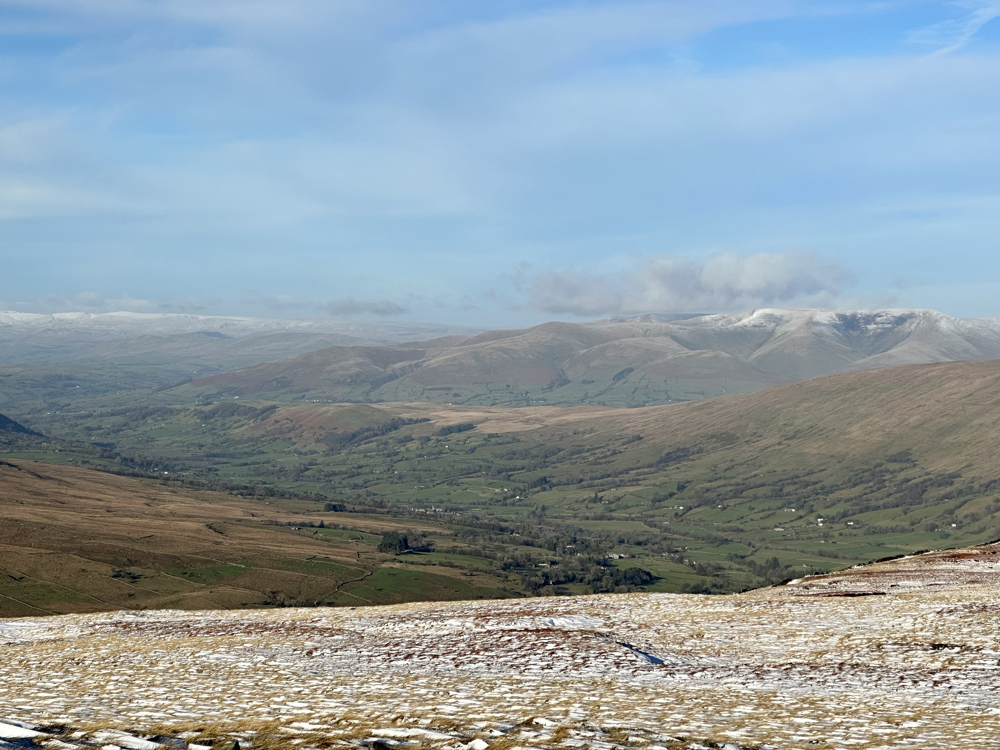

To the north-east: views fully opened across Dent Fell. Emerging from the other side of Blea Moor tunnel, the Settle-Carlisle line could be seen crossing (right-to-left) [Dent Head](https://en.wikipedia.org/wiki/Dent_Head_Viaduct) and [Arten Gill](https://en.wikipedia.org/wiki/Arten_Gill_Viaduct) viaducts, with Great Knoutberry hill towering over the latter.

It was tempting to linger here indefinitely, the views more than paying the debt of the ascent. But I had not finished, not quite yet. A gentle uphill walk would see me to the true summit.

As I proceeded, drifting snow lined the path and walls, accumulating to six inches in parts. The grass and brickwork appeared petrified by the onslaught of sub-zero moisture and heavy overnight winds. In one place, ice formed on a wire fence had come loose but stuck further down, retaining its gridded shape.

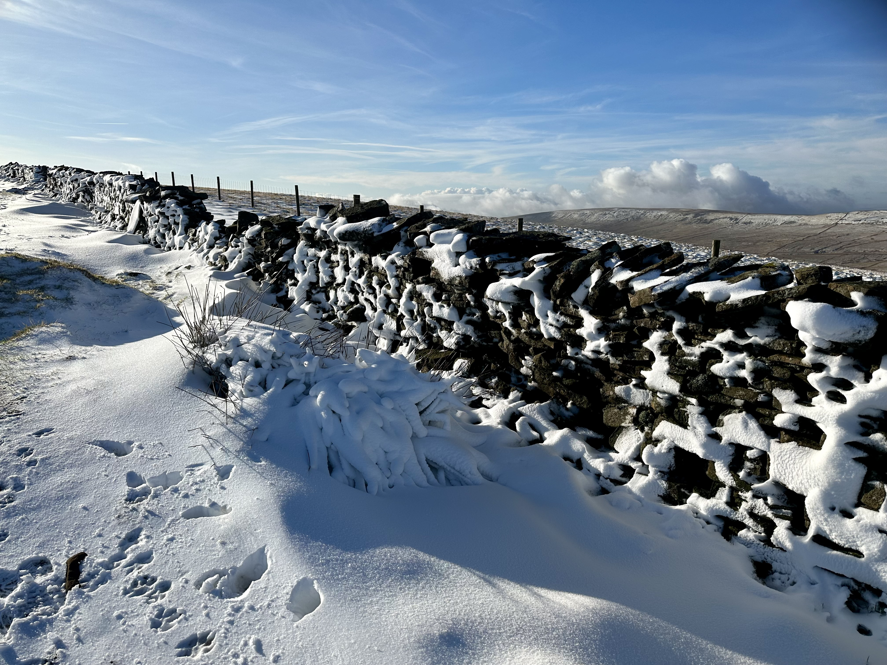

The summit itself was a muted affair. No large cairn of stones greeted me. In fact, the first sign of completion was a crowd of fellow hikers taking well-earned breaks. Between the wall a stile formed of two stones provided access to the [trig point](https://en.wikipedia.org/wiki/Triangulation_station#United_Kingdom), the *official* summit. A quick touch of skin to the metal plate affixed to the concrete sealed the deal.

Here, much like on the ascent, hikers are a friendly community, united by a shared love for their pursuit and the challenge before them. My leisurely pace meant other hikers passed me with regularity. Camaraderie was typically present, along with small talk, though not much more as everyone was driven to continue. At the summit this need abated, even if temporarily.

The wall here is intentionally curved on both sides with slate slabs jutting out from the bottom to form makeshift seats. In these crevices hikers sat, enjoying their warm flasked drinks and packed lunches. I asked if I could join one group and was welcomed immediately. Conversation was cheery and light, talking mostly of the conditions, hometowns, further destinations and hiking aspirations. A lengthy debate started when I produced sausage rolls for my lunch: sausage rolls or scotch eggs - which made the better hiking food?

Couples, friends, and families came and went quickly, keen to press on to nearby Ingleborough or other destinations. I chose to remain for some time, my only remaining goal to complete my circular route back to my car. Another couple joined me with two dogs. Then two more. A man in his fifties with a strong Yorkshire accent offered me whisky from his flask. I eagerly obliged a polite sip.

Upon standing to begin my descent, I looked over the edge and witnessed Ribblehead Viaduct bathed in low sunlight. Below it, the farmsteads and walls I would need to navigate once down from Whernside. What a sight, these moors that humanity dared to build across so brazenly.

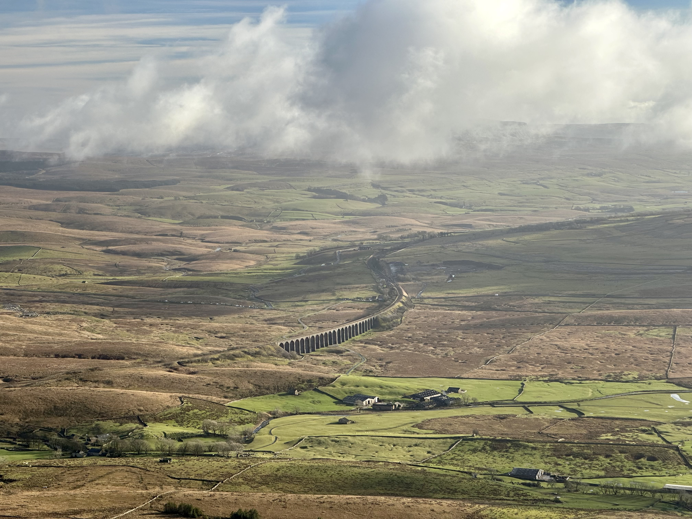

## Descent and Return

The deed done; it was time to descend the other side of Whernside. Not armed with experience or local knowledge, I'd inadvertently summited "the correct way around" - my descent would be much steeper, a much easier task with the aid of gravity.

As the gently descending path along the ridge became a staircase of uneven rocks, I stopped to watch a Northern train cross Ribblehead Viaduct heading north. I was lucky to catch it at this distance - a silver strip glinting in the sun.

While stopped I was caught up by another pair of hikers. I got chatting with them about my travels last year, descending with them as far as the gate demarcating the boundary between the hill and farmland below. My knees shaking, I took the last of my water and pondered my next move. I had already deviated from my original plan of passing under Ribblehead Viaduct on the way to Blea Moor tunnel, so I wanted to return under it. That would take me directly through farmsteads rather than directly to the road and along it.

Descending further, Ingleborough teased its summit beyond the clouds, increasingly back above me. The remaining descent mercifully began to level off, turning from rocks and mud to stone slabs then finally to spongy gravel.

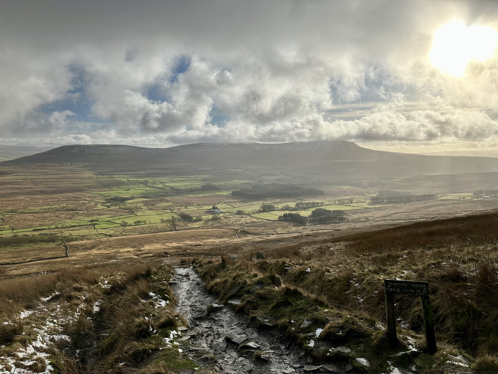

## Across Fields and Farms

By the time I had reached the next gate and crossed into a field full of colourfully tagged sheep, the flat-topped fell reared its head at last. Ingleborough in all its glory. If only I had more daylight to play with. It would have to wait for another winter weekend.

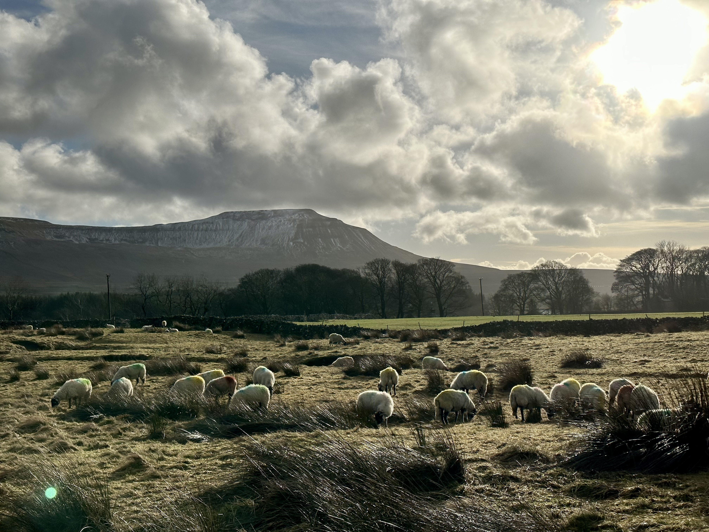

At the next gate I committed to my choice to follow a public right of way north-east. First, I would enter directly into a grazing field for sheep. From the gate I watched five sheep eat hay with nary a care in the world, not even my nearby presence. I entered their home with trepidation.

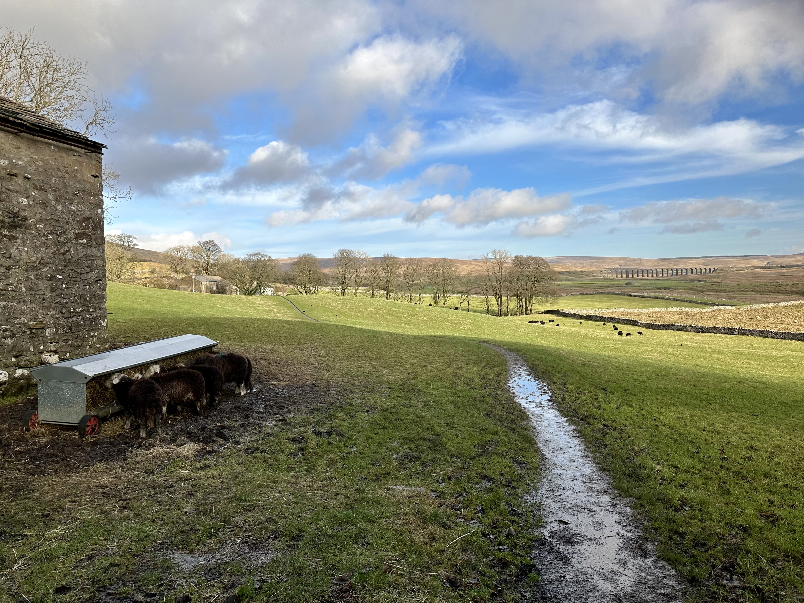

Here I was directly confronted with the juxtaposition between ancient rights of way, paths providing egalitarian access to the natural countryside and all its bounties, with stone walls penning in livestock on private land. Both systems exist on top one another, sometimes begrudgingly. I followed the instructions laid out on the gate: single file along the gravel track. A farmer's effort to limit damage to the pasture and allow the sheep undisturbed places. Quite a fair compromise in my opinion. I trekked through the path's mud puddles obediently.

At the field's end lay several houses, one converted into a weaver's studio. A sign affixed to a tree advertised the course for the high season. Here in January, tourism is seemingly sparse and not worth sitting around waiting for.

The next field was as pristine as the last: gentle green grass with no signs of stones or trees, save for the field's edge. Here an escarpment and jagged trees acted as the border of reasonable effort to churn this land into something the sheep would love. Cascading from these rocks was a windswept waterfall. I approached, though I was not alone.

The hiker behind me was quick to inform that this waterfall is rarely present, and this is only his third time witnessing it in as many decades. Its significance was perhaps lost on me, but I appreciated it as I would any other waterfall. He snapped countless photos from every angle, including its top, while I sat patiently for my turn.

We chatted for a time. Mentioning living near Newcastle-upon-Tyne, he regaled me a tale of a recent weekend spent in the city, in search of new scenery and a quiet weekend away from his native Yorkshire. I asked about the neighbouring fells. By this point I was set on returning for the other two of the Yorkshire Three Peaks.

For the next while the return walk was much the same, though excitingly the right of way passed directly through two farmyards. My fellow hikers and I contemplated the best route back to Ribblehead Viaduct, the signposts only getting us in the right direction. Many a muddy field of sheep needed to be crossed, with the following stile hard to pinpoint over undulating hills. Eventually an access road was found, followed by the other end of the well-maintained gravel path that I started my hike on.

## Ribblehead Viaduct Up Close

The path snaked closer to the viaduct. By this point the 14:25 sunset illuminated the brickwork on this side, revealing every imperfection, every affixed metal plate, every leaky drainpipe.

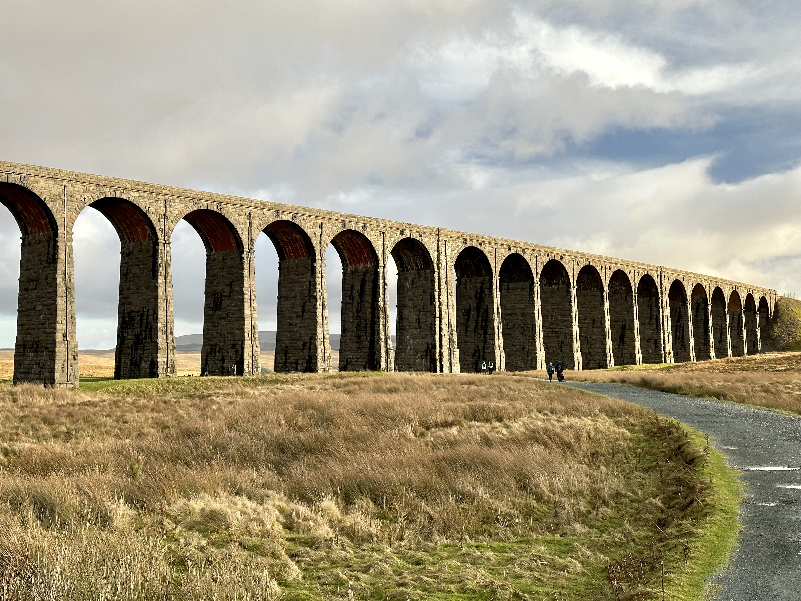

From up close the notion of a cookie-cutter repeating design falters. That is not to say the design is sloppy, but details such as the spans grouped in sixes and the differing brickwork become apparent.

Even from here, the beauty of this structure on the moors is apparent. From the angle of approach, nothing but grass and sky can be seen through its arching spans. It appears as if anchored in a sea of grass, swelling all around it.

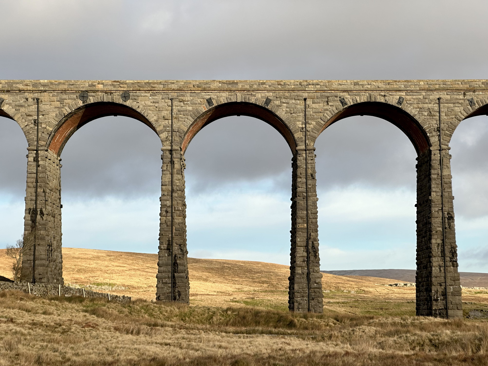

## Conclusion

It was a remarkable pleasure to spend some quality time visiting the Yorkshire Dales, a place I have a newfound fondness for that will need satisfying again soon. Fortunately, trainspotting will have me back the next two weekends!

Hiking in such clear winter surroundings proved equally enjoyable, and the statistics of the hike will spur me to ascend to loftier heights in preparation for truly ambitious summits on my monthly adventures - in particular the peaks of [South Uist](https://en.wikipedia.org/wiki/South_Uist).

- **Distance:** 13.15 km / 8.17 mi
- **Max elevation:** 736 m / 2,414 ft
- **Total ascent:** 506 m / 1,660 ft
- **Time taken, including breaks:** 6 hours 15 minutes
