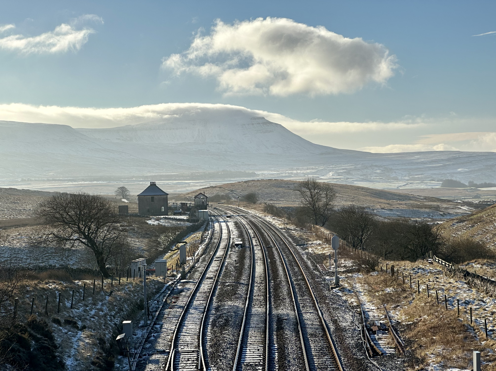
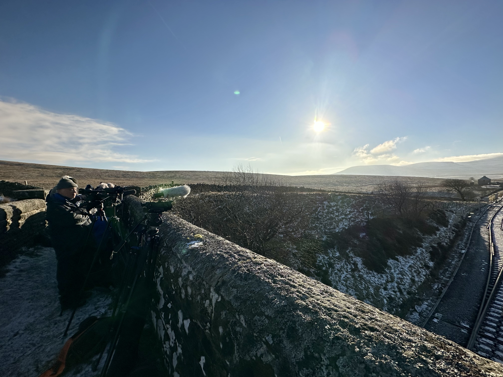
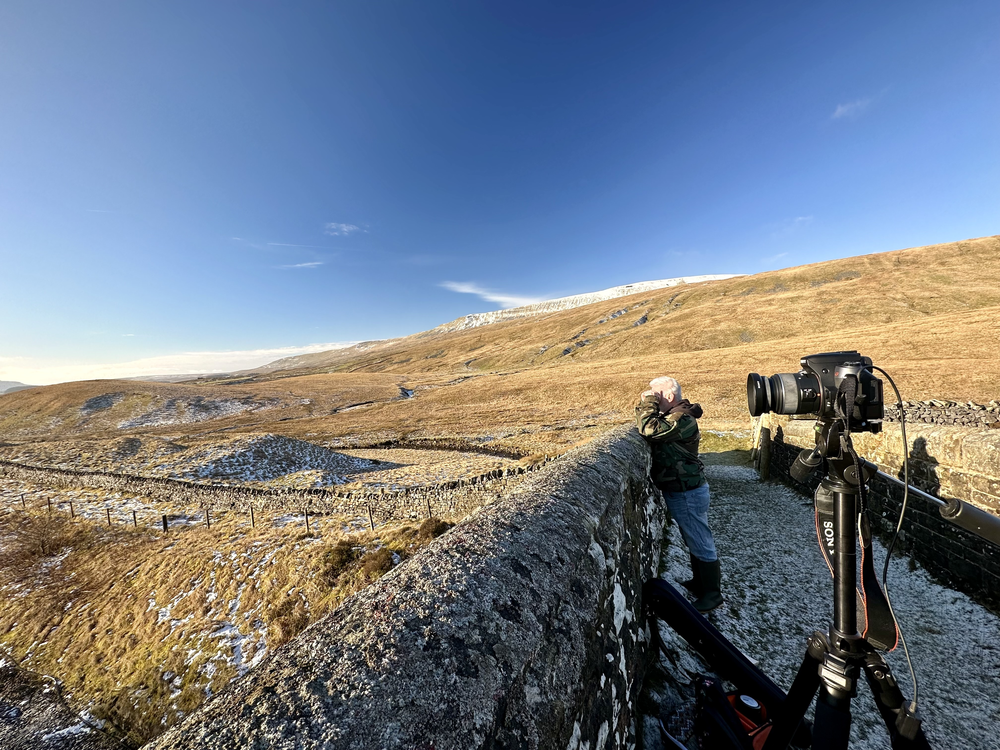

# Adventure Week 3: Steam at Blea Moor

- Tags: Adventures 2023, Rail

Following a successful foray last week to Ribblehead Viaduct and the Settle-Carlisle line, I returned to capture a steam locomotive traversing the snowy Yorkshire Dales.

## Double Dipping

First off, let's address the elephant-in-the-room: yes, I'm effectively repeating a location, and [claiming it as an adventure for the week](./2023-01-04-committing-to-adventures-in-2023). Now, the excuses: I named [Ribblehead Viaduct and Whernside](./2023-01-17-adventure-week-2), not Blea Moor, which is part of the surrounding area, but really, we're talking about the Blea Moor signal box. Secondly, part of last week's goal was to scout out a location for this very photo shoot, so this isn't a cop-out.

With that out of the way, let's begin!

## Return to Ribblehead

Another Saturday, another early morning in search of the Yorkshire Dales. Today my car boot is full of equipment. The goal is simple - video and photograph [The Winter Cumbrian Mountain Express](https://www.railwaytouring.net/the-winter-cumbrian-mountain-express) from the footbridge above the Blea Moor signal box, facing the peak of Ingleborough across the valley.

After last week I was quite confident in the location I'd selected. The footbridge afforded a good view of the line and would seat the train amongst remote dales, with nary a sign of modern civilisation. The perfect time capsule.

To make the most of the fleeting moment, I'd brought not one but two cameras and tripods (though one was my phone) - one for video, one for photographs. Without a specific timetable to work with, and thus only a best guess at what time the train would pass through, I'd also assembled a folding stool and a backpack of goodies: water and wires, but most critically a battery bank in case my phone got hungry.

The first challenge would be reaching the signal box. Or perhaps even, carrying all this stuff. I threw my backpack on over my coat, then hung each tripod strap from a separate shoulder. My camera bag went on cross-shoulder without fuss. As soon as I tried to lock the car, it became clear that the tripod bags wanted to abandon ship. Nevertheless, I pressed on. It was 10:00 and I figured I had between zero time and two hours before the train. No time to reconfigure. There was only the climb.

Climb is generous, for aside from one set of stone steps, the walk slopes gently uphill and undulates as it likes. The added weight of metal and glass made each step double the effort. I shuffled shoulders and grasped at straps to keep everything in place, fighting a losing battle, all the while rushing and panting. The signal box was further than I thought. Once there, I only had to hop a stream and ascend a grassy hill to reach the bridge.

## The Waiting Game

Arriving at the bridge I said hello to two already waiting trainspotters, hopped the stile, and picked a spot. I ended up just short of centre of the bridge rather than all the way at its far side as I'd originally planned, mostly due to the angle of the sun threatening to spoil the show, and out of an unconscious desire to follow experienced people who clearly knew best. I threw my gear down and hurriedly set up my new tripod and phone, for only once this was complete could I breathe a sigh of relief and slow down. Once both tripods were setup and my gear tidied, I could take stock.

I could not have asked for better conditions. A mostly blue-sky day, only small puffs of cloud and strands gathering on Ingleborough to spoil the low winter light. Snow was more abundant than last week, some between the rails below, and considerably more lining the distant valley and hills. I was excited!

## Trainspotters

Not one to stand idly next to others without at least attempting to strike up some conversation, I attempted to befriend the trainspotters. First, the most crucial question: what time are we expecting? 11:05 one replies confidently. Forty minutes to kill. At least there'd be enough time to dial in my Sony Alpha a550. The old workhorse finally came out of retirement.

Before long, a whole gaggle of trainspotters emerged, erupting into familiar conversation - clearly friends meeting up for a morning of purpose. Eavesdropping, I learned crucial information quickly - the train was running, it was "[Black 5](https://www.railwaytouring.net/44932)" (from the pool of the operator's steam engines, not known ahead of time), it had reached its first stop for water, but it was "twenty late". No matter, the diesel locomotive at the rear would get it caught up with a boost of power - it's not uncommon for a near ninety-year-old steam locomotive to need some help. Then, a rumour that twelve carriages were running, more than normal. This confused some - the operator recently had a sale which suggested slow sales: conflicting information.

It was nice being in experienced company, even if I felt and looked ever the outsider. I was merely here with my own equipment, trying to catch a piece of the same magic that they were. In my case it was fuelled by childhood nostalgia of similar once-in-a-blue-moon events. For them, it was perhaps the specifics of an oft-repeated experience. One trainspotter remarked at how most of their time spent was simply waiting. We all waited patiently, all the same.

A few light conversations and occasional interjections later, I had successfully been welcomed in, though I still stuck out like a sore thumb. A current-gen smartphone on a new tripod draw curiosity, with comments about how phones can do anything these days. Their chunky tripods and decades-old video cameras might have looked primitive, but these guys knew what they were doing - good microphones and a purist's eye for the perfect static shot showed their experience, their craft.

Meanwhile I tinkered with my DSLR. After all, my phone needed no help, and I left it to record a timelapse of the rolling clouds on Ingleborough. Out of practice, aperture priority mode would do for today. I fiddled for a while with ISO, white balance, metering, focus zones, and dialled in something that looked decent on a fifteen-year-old dim LCD screen. I wired up my remote shutter and rehearsed a burst of seven photos. The recognisable snap of the mirror moving out of the sensor's way with each photo.

Two Northern diesel multiple units passed through in opposite directions in quick succession, giving a chance to test everything out. The video looked okay. The photos looked okay. Now we simply waited for a distant horn beep to be replaced by the toot of a steam locomotive.

## A Black Bullet

Then, it was time. Everyone jumped to action stations, and I was no exception. The chugging sound of steam activated pistons echoed across the dales until a moving plume of smoke emerged from above Ribblehead Viaduct, unsighted for now. Black 5 rounded the corner, giving it full beans on its ascent towards Blea Moor tunnel. My nearest trainspotter silently cautioned me about the noise from my waterproof coat. With one hand on my video tripod's arm, I got ready to pan down, and with the other I took bursts of photographs.

The chugging sound intensified as steam was sent flying into the air above, drifting gently to the side, keeping Ingleborough clear in shot. Jets of steam took turns shooting from each side of the pistons mounted in front of the wheels. A haze of diesel rose from the rear locomotive.

For a moment I forgot to be present in the moment, so I looked with my own eyes, only to see a steam locomotive travelling directly towards me, as if it was ready to leap from the rails and over the bridge. The noise and steam grew until it was upon us - a silent cloud of steam as the locomotive passed under the bridge before emerging. A line rolling along the straight tracks towards the tunnel. It was over.

<youtube id="DUyo3j7D128" />

Was it worth the wait? Absolutely! It is hard not to feel child-like awe in the face of such machinery, such drama. I'd have been thrilled just to be here, but had I done the moment justice for the permanent record?

## Blunders and Trepidation

At first look, the video looked spot-on. Only once home did I realise that I hadn't set the video to 4K 60 frames-per-second, which was a missed opportunity. The main issue with relying on HD is any frames I would pull from the video wouldn't be crisp.

I had been nervous about using my DSLR today. After twelve years away from it, I've retained my *photographer's eye* for subject and composition but have shed most technical understanding of a camera of this sort. After all, smartphones are point and shoot, and the latest breed employ stabilisation and AI that can flatter in an instant.

Still, I'd majorly underprepared. Firstly, five minutes before the train passed, I noticed fogging in the bottom-right corner when reviewing taken photos. This wasn't present through the viewfinder or live view, suggesting an element behind the mirror was at fault. With temperatures below freezing, I'd neglected to use my lens warmer to ward off condensation - a recent purchase for astrophotography.

Beyond that, the lenses were filthy. A mixture of hair, fibres and dust collected on the lens and behind it ruined even the photos before the condensation and contributed to bad auto-focus. This was a stark wake-up call: I need to be more prepared, diligent, and knowledgeable if I am to use my DSLR effectively again.

Still, I post this here for posterity and for completeness. We are more than our final best effort.

## Conclusion

A spectacular sight to behold, one I wish to repeat soon and often. The experience was made more enjoyable by the company of knowledgeable older trainspotters and their insights on what to expect. Next time I'll need to come as prepared for photography as they were.
