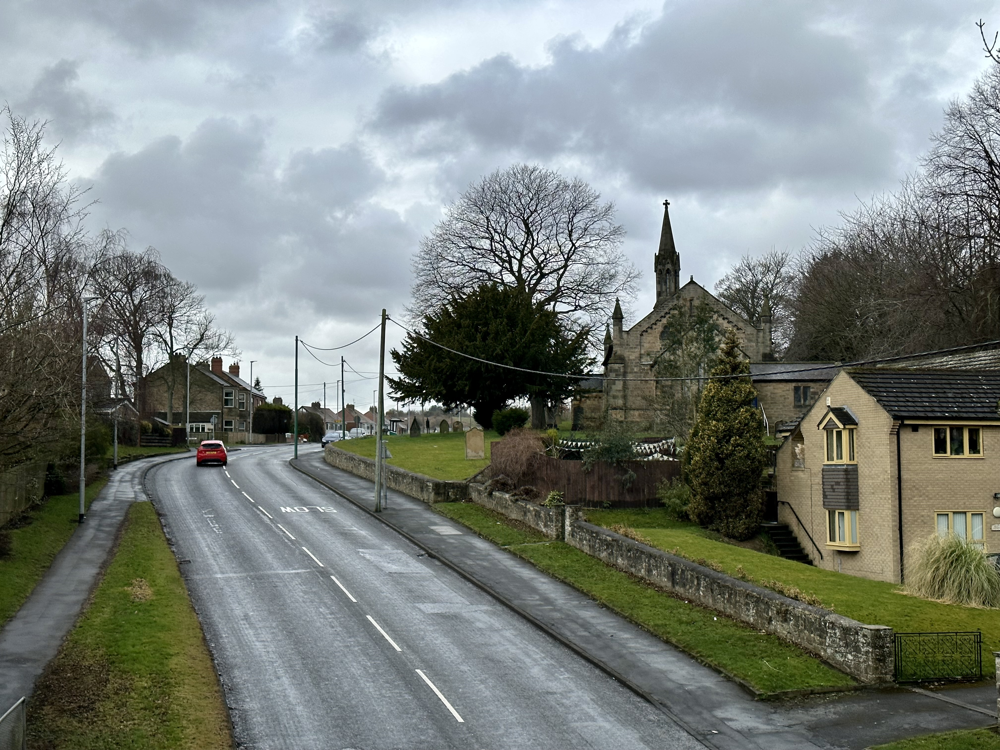
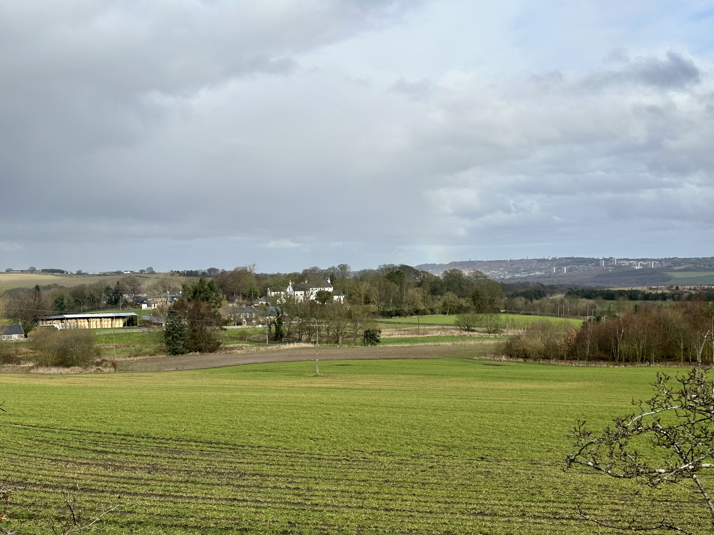
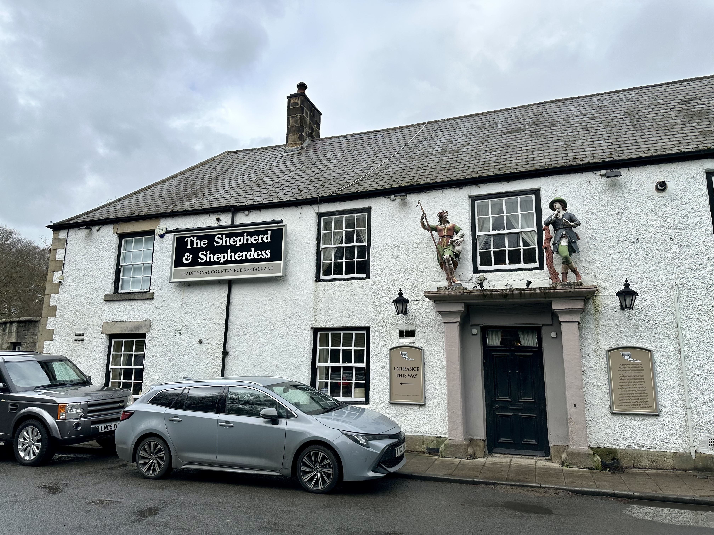
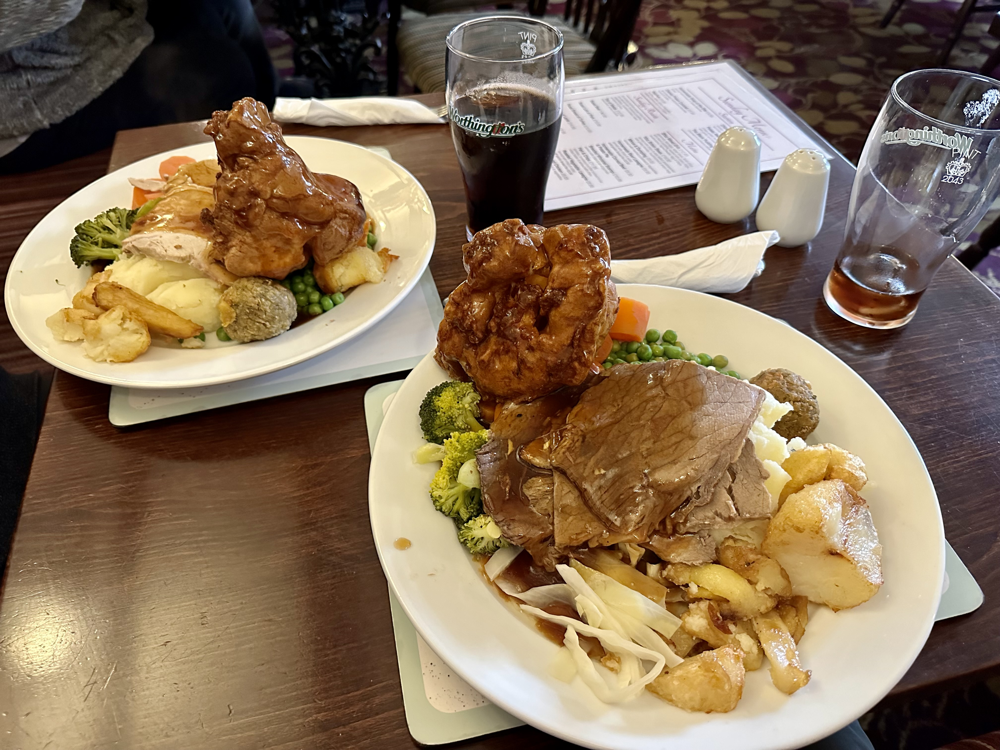

# Adventure Week 8: Beamish Cows

- Tags: Adventures 2023

A walk from home along the C2C cycle route to visit some of its unique artwork turned into a long trip out for Sunday lunch.

## Finding Local Wonders

Following a [week long holiday to Glen Etive](./2023-02-25-adventure-week-7) in the Scottish Highlands, which counted as week 7 of my year of weekly adventures, I needed a leisurely Sunday activity to get me outdoors for an hour. Fortunately, I'd already done my homework.

I'm the sort of person who loves a map, whether it be digital or paper. As a result, it may come as no surprise that I spend plenty of times poring over Google Maps. No matter if it's somewhere curious, somewhere I want to go, or have recently been, I've probably looked at it from a satellite. Understanding the geography and relativity of places helps me build up a proper understanding of the area and excites me to explore further.

In mid 2023 I started planning holidays and outings using custom Google Maps, diligently adding pins with useful items and pins. This system informs both early trip ideas and specific daily itinerary building. As part of this I have a "wish list" of potential destinations, built from self-guided scouring and online inspiration. The United Kingdom and beyond is littered with black circles, each a potential stop on a trip.

When I started my [new year's resolution](./2023-01-04-committing-to-adventures-in-2023) I searched for more wish list destinations around my local area and the north-east in general, knowing that on slower-paced weekends I'd appreciate something closer to home. Beyond that, it's nice to see more of the place you live. This hunt included finding ["Beamish Cows"](https://www.google.com/maps/place/Beamish+Cows/@54.8767866,-1.6583834,17z/data=!4m6!3m5!1s0x487e7919c11b6283:0x29a0fecb2ed63f8!8m2!3d54.8767866!4d-1.6561947!16s%2Fg%2F11hr_c_x93) not too far from home...

## C2C or Sea to Sea

Within walking distance of our house is the [C2C cycle route](https://www.sustrans.org.uk/find-other-routes/c2c-or-sea-to-sea), often mistakenly called "coast to coast". It runs from Whitehaven in the west Lake District to Roker in Sunderland in the north-east. From Irish Sea to North Sea. Along its 137.5-mile route, cyclists will ride along one of County Durham's old railway routes, long since turned into a public cycleway.

This section is a frequent source of my summer evening walks and ill-fated [Couch to 5K](https://www.nhs.uk/live-well/exercise/running-and-aerobic-exercises/get-running-with-couch-to-5k/) attempts, providing an easy gradient and abundant friendly dogs. It would be the scene of today's adventure.

## Breaking New Ground

While I've walked parts of the C2C in both directions from home, I've only gone so far. This has traditionally been dictated by the length of my run or of my lunch break, as evening walks tended to venture off the route across fields or through nearby villages.

Sophie and I set off on a grey day that threatened rain, the ground already damp. Familiar sights would be reached first, with some favourites worth noting:

At Pelton, the route crosses a road within view of Holy Trinity Church, its slender spire poking above its tree-filled grounds. The composition of rising road, telephone poles and church has proven inspiring, though typically with clear skies or sunset.

Not much further along, the trail passes under the A693 and immediately the scenery to the right opens up - rolling fields and a distant view north-east. With binoculars or sharp vision, the tower blocks of Harlow Green can be spotted, and amongst them, [Angel of the North](https://www.gateshead.gov.uk/article/3957/Angel-of-the-North) above the A1(M). Even St James' Park can be spotted in Newcastle city centre.

Before this scene, rolling farmland gives home to a farm, stored hay bales, and a white house amongst the trees. This view marks the furthest point I've been west on the C2C. Time to press on.

Beyond this the route races towards Beamish, past High Handenhold. The odd bridge provides curious glances across back gardens and country lanes, but the sightlines here keep us fixated on the tunnel of trees. Eventually a sign for [The Angel's Way](https://www.thisisdurham.com/northernsaints/see-and-do/the-angels-way-p1053001) reminds us that there are other routes here, this one running north to south, stringing together various attractions and historic sites.

## Mechanical Bovines

After one more Victorian tunnel, now oversized for a mere footpath and cycle route, rust-coloured quadrupeds come into view. We arrive at the cows.

["Beamish Shorthorns" by Sally Matthews](https://artuk.org/discover/artworks/beamish-shorthorns-315094) was commissioned by Sustrans in 1990 for the C2C cycle route, which opened in 1994. Consett steel was used to fashion four shorthorn cows, taking inspiration from cows next to her workshop in Beamish.

Initially appearing skeletal, closer inspection shows an attention to detail with respect to anatomy and disposition - each cow is posed differently, each seemingly with its own personality. Particular detail has been paid to the head, so it was no surprise that we found ourselves viewing the cows as real creatures, suspension of disbelief achieved.

Their place along the route is banal except for the nearby tunnel, affording a few choice angles for photos. Steep banks on either side covered with trees extend the feeling of a tunnel beyond the cows, and beyond them a path cuts upwards to the road passing over the tunnel, leading directly to [Beamish Museum](https://www.beamish.org.uk/).

Perhaps the allure of the cows isn't fully realised at this time of year - noisy and rusty metalwork detail easily blends into the background of leaf mulch and bare branches. With dense greenery surrounding the cycle trail, they would pose a more obvious landmark. Perhaps a revisit later this year will be in order.

After a few moments inspecting the cows, considering the artwork, and taking photos, it was time to move on.

## Sunday Lunch

Aside from visiting the cows, Sophie and I planned to grab lunch while out. A small collection of eateries in Beamish village gave us a few options at the turning point of our walk. As it was Sunday, a roast dinner from a local pub was far and above my preference.

_The Shepherd & Shepherdess_ delivered exactly that. Just around the corner from Beamish Museum's red metal archway welcoming you along its entrance road, stands a typical English pub. This white building of indeterminate old age and clear character was already alive with activity on our arrival at 12:10, with lunch service having begun at 11:30.

It had been some time since I'd been in a pub like this, a haven for locals looking for drinks, familiar meals, and socialisation. This part of County Durham is littered with former coal mines (234 in 1947, now zero), leaving former mining villages that have struggled economically since the closure of their lifeblood, right to the modern day. As Beamish is one such village, a strong working-class sensibility is felt here.

We picked a table in the corner and perused the menu, mostly concerning ourselves with which meat we wanted with our roast dinner - beef for me, chicken for Sophie. While we waited, the remaining tables were claimed as the real Sunday lunch rush arrived. Patrons stood outside to drink and smoke. Some cyclists stopped in for a quick drink before continuing on their way. A buzz of activity.

After a torturous wait, dinner was served. Generous portions delighted, especially the large Yorkshire puddings soaked in gravy. Shredded lettuce was an odd inclusion, as were balls of stuffing, though these were more appreciated. Tender meat and flavourful roast vegetables were balanced by undercooked carrots, likely cut too thick for their boil time. Overall, an enjoyable and filling meal, a touch rough around the edges - typical as there are too many elements to a Sunday lunch to ace every single one of them.

## Return

Once paid up and out the door, the only thing that remained was to walk home, a gross miscalculation on now full stomachs. With rain hanging in the air all day and further spots felt before back to the C2C cycle route, it was shaping up to be a miserable hour.

Fortunately, rain clouds came and went without incident, and after a while my stomach got used to its load and settled into the walking routine. We were back home before we knew it, happy for the walk, cows, and filling meal.

## Conclusion

Getting out on foot and finding walkable sites in your local community is a valuable spend of time, particularly if you typically choose to drive everywhere. The Beamish cows were fun to see and provided a great excuse for a two-hour walk, rewarded by a hearty Sunday lunch.

In the coming months I'll be looking to fan out further in my local area, seeing how far I can get with a few hours of walking, particularly on weekend days where I'm not travelling, hiking, or just want a little bit of exploration.
